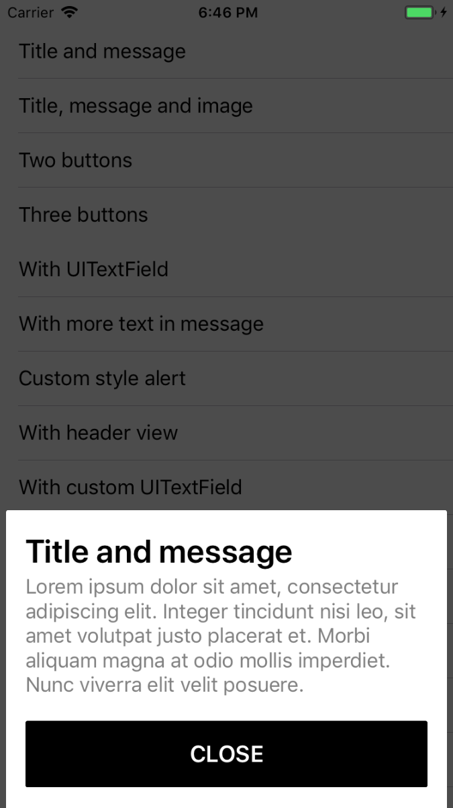
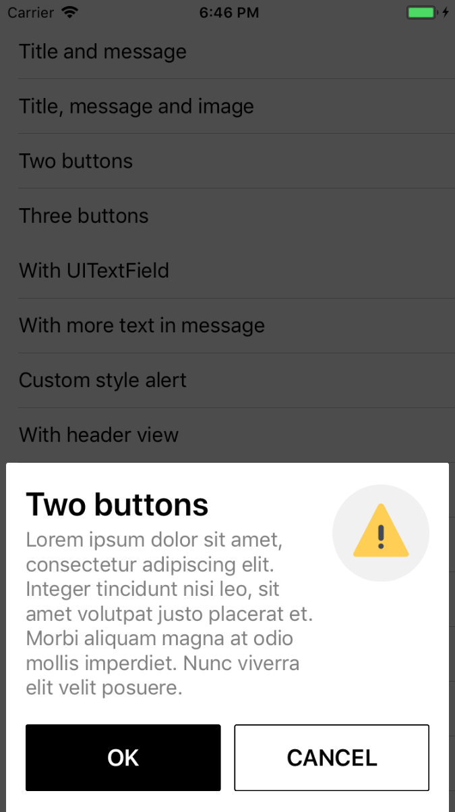
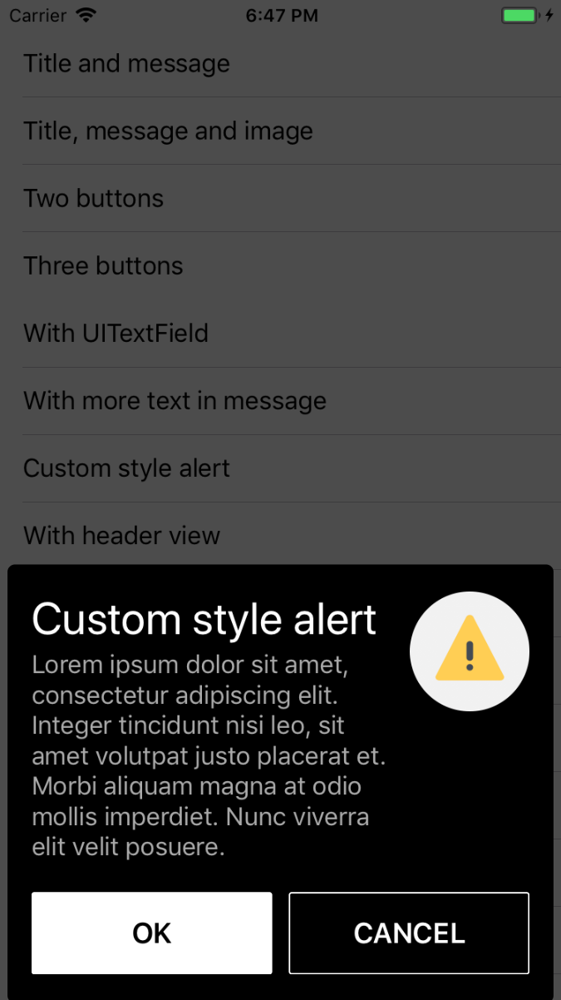
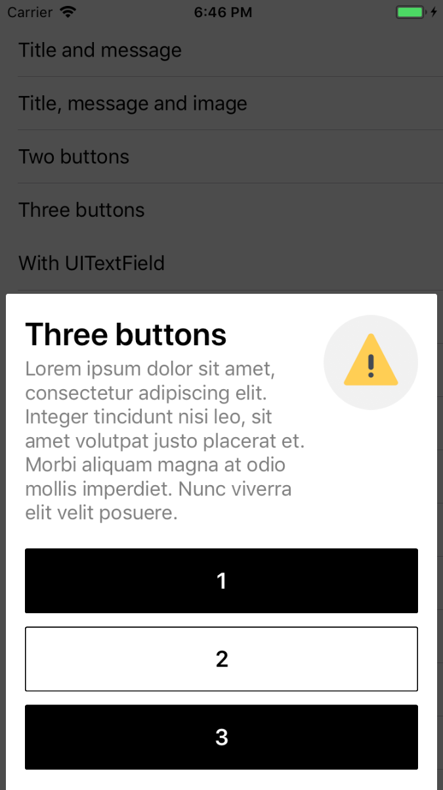
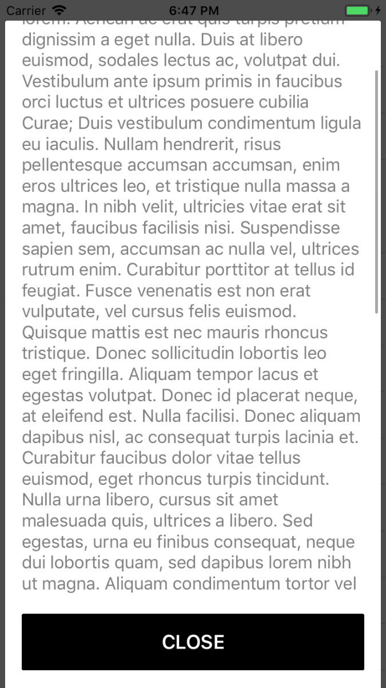
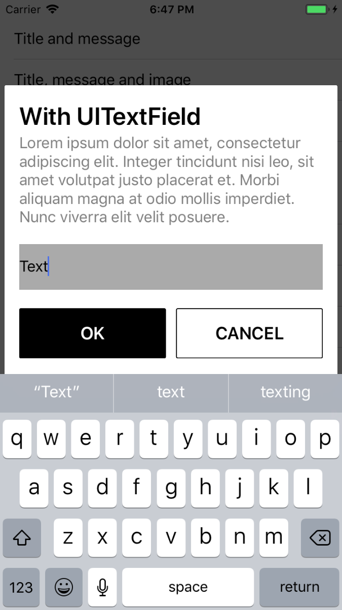

[](https://img.shields.io/cocoapods/v/KOAlertController.svg)
[](https://img.shields.io/cocoapods/p/KOAlertController.svg?style=flat)
[](https://travis-ci.org/SethSky/KOAlertController)

KOAlertController is an custom alert controller library written in Swift.
Use this class to configure alerts and action sheets with the message that you want to display and the actions from which to choose

<div align="center">






</div>

- [Features](#features)
- [Requirements](#requirements)
- [Installation](#installation)
- [Usage](Documentation/Usage.md)
- [Screenshots](Assets/)
- [License](#license)

## Features

- [x] Add actions with style button
- [x] When configuring an alert with the alert style, you can also add text fields to the alert interface
- [x] Has the ability to use custom text fields
- [x] Custom style (Colors, Fonts, Padding)
- [x] Add Image to the right area alert view
- [x] Built-in scroll into the content area
- [x] Supported landscape and portrait interface orientation

## Requirements

- iOS 9.0+
- Xcode 8.3+
- Swift 3.1+

## Installation

### CocoaPods

[CocoaPods](http://cocoapods.org) is a dependency manager for Cocoa projects. You can install it with the following command:

```bash
$ gem install cocoapods
```

> CocoaPods 1.1+ is required to build KOAlertController 1.0.1+.

To integrate KOAlertController into your Xcode project using CocoaPods, specify it in your `Podfile`:

```ruby
source 'https://github.com/CocoaPods/Specs.git'
platform :ios, '10.0'
use_frameworks!

target '<Your Target Name>' do
    pod 'KOAlertController', '~> 1.0.2'
end
```

Then, run the following command:

```bash
$ pod install
```
## License

KOAlertController is released under the MIT license. [See LICENSE](LICENSE) for details.
